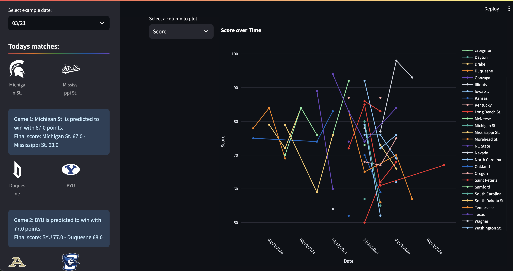
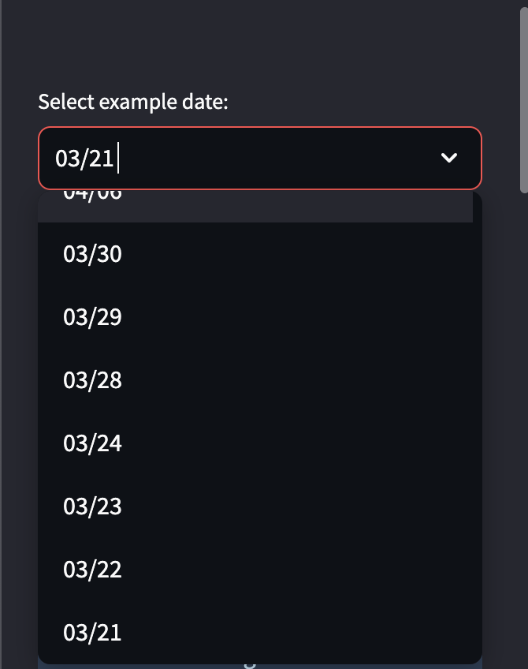
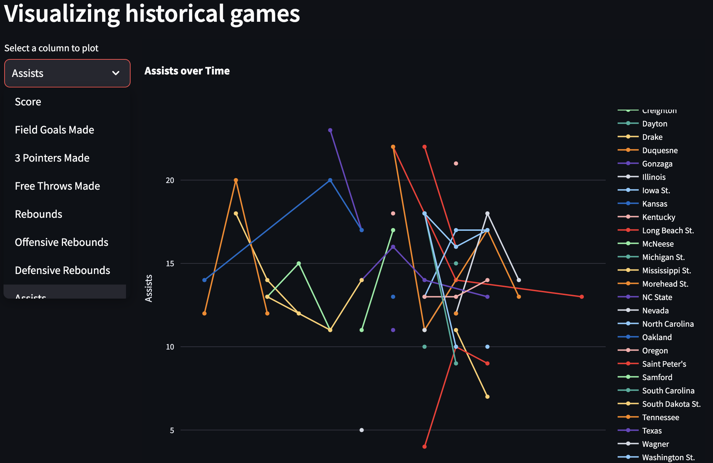
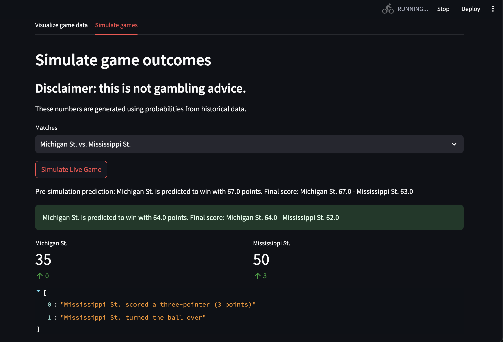
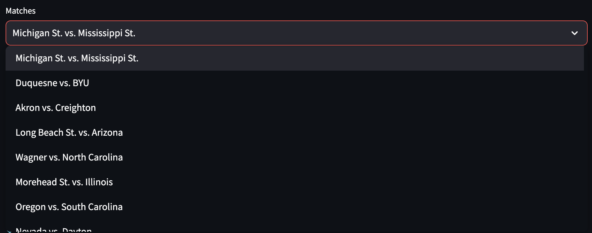

This was a project to see if I could use real-time March Madness data to predict the winners of match-ups. I used web scraping to gather data from the NCAA website and then trained a RandomForestRegressor model on the features that were most indicative of a win (using a correlation matrix to identify which variables had the strongest correlations with Score). Then based on the predicted score, a winner would be determined.

To run this project locally:
Git clone the repository to your local machine.
Open terminal and navigate to the cloned folder.
Run 'streamlit run st_app.py'

When the app starts, the first page you'll see is the visualize game data page. It will show the historical data for the games that are playing for the given day.

On the left side, you can select the date, and the days matches will be listed below with predictions for their scores.

On the right side, you can choose a metric to analyze over time. This makes it easier to see how teams compare for specific stats over time.

When the Simulate Games tab is selected, the user has the option to simulate a game between teams from the selected days matches.

